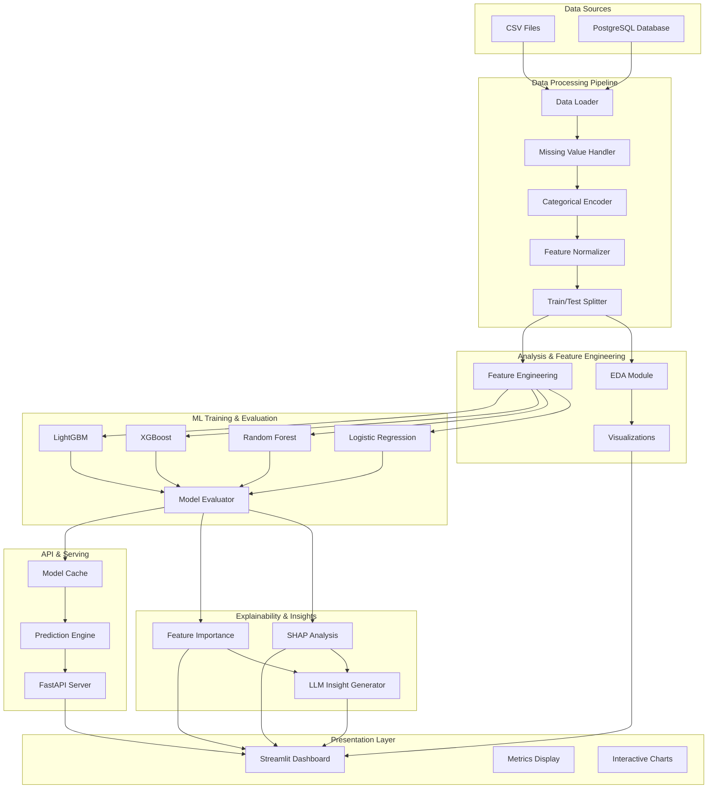
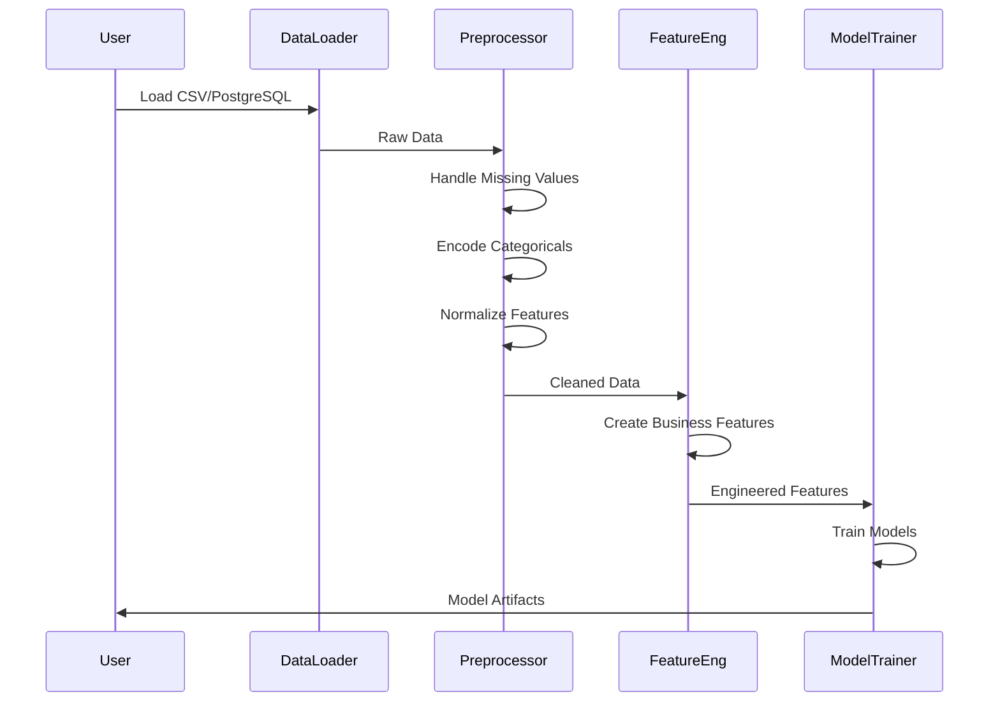
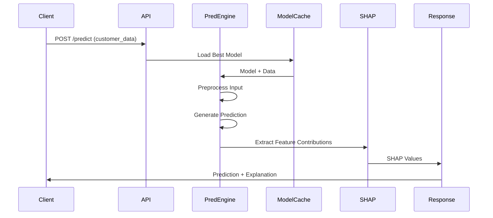
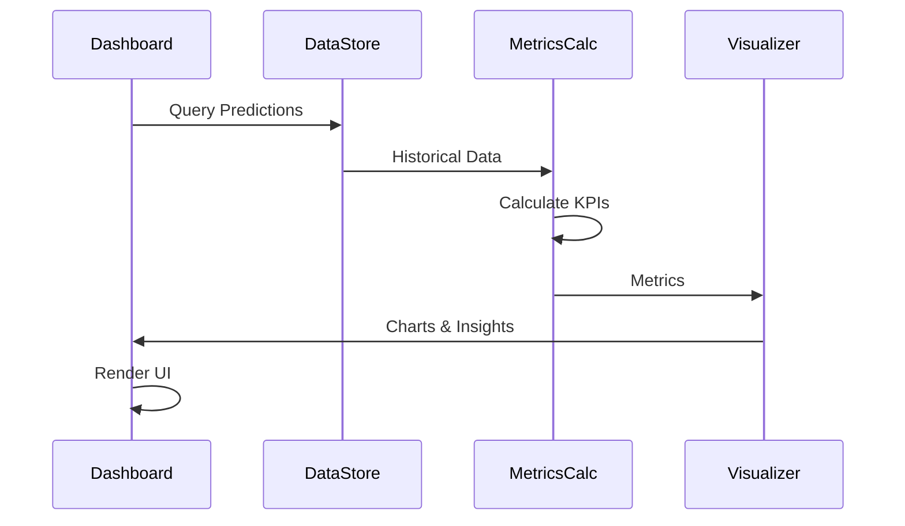

# Design Document: Customer Churn Prediction System

## Overview

The Customer Churn Prediction System is an end-to-end machine learning platform designed to identify subscription-based customers at risk of cancellation and provide actionable business insights for retention strategies. The system processes customer behavioral and transactional data through a sophisticated pipeline that combines data engineering, feature engineering, multiple ML models, explainable AI analysis, and real-time prediction capabilities. It serves subscription businesses across telecom, SaaS, and streaming industries by enabling proactive customer retention through data-driven decision-making.

The architecture emphasizes modularity, scalability, and interpretability—allowing data scientists to experiment with models while business stakeholders access insights through intuitive dashboards and APIs. The system integrates with existing data sources (CSV, PostgreSQL), trains ensemble models, explains predictions through SHAP analysis, and exposes predictions via REST APIs and interactive visualizations.

## Architecture



## Sequence Diagrams

### Data Processing Flow



### Prediction Request Flow



### Dashboard Update Flow



## Components and Interfaces

### Component 1: Data Loader

**Purpose**: Loads customer data from multiple sources (CSV files, PostgreSQL database) and provides unified interface for downstream processing.

**Interface**:
```python
class DataLoader:
    def load_csv(filepath: str) -> pd.DataFrame
    def load_postgresql(connection_string: str, query: str) -> pd.DataFrame
    def validate_schema(data: pd.DataFrame, schema: Dict) -> bool
    def get_data_summary() -> Dict[str, Any]
```

**Responsibilities**:
- Connect to data sources (CSV, PostgreSQL)
- Validate data schema and integrity
- Handle connection errors and retries
- Return standardized pandas DataFrame
- Log data loading metrics (rows, columns, data types)

### Component 2: Data Preprocessor

**Purpose**: Cleans and transforms raw data into a format suitable for machine learning models.

**Interface**:
```python
class DataPreprocessor:
    def handle_missing_values(data: pd.DataFrame, strategy: str) -> pd.DataFrame
    def encode_categorical(data: pd.DataFrame, columns: List[str]) -> pd.DataFrame
    def normalize_features(data: pd.DataFrame, method: str) -> pd.DataFrame
    def split_dataset(data: pd.DataFrame, test_size: float, random_state: int) -> Tuple[pd.DataFrame, pd.DataFrame]
    def get_preprocessing_config() -> Dict
```

**Responsibilities**:
- Handle missing values (mean, median, forward-fill, drop)
- Encode categorical variables (one-hot, label encoding)
- Normalize/standardize numerical features
- Split data into train/test sets
- Store preprocessing configuration for inference

### Component 3: Feature Engineer

**Purpose**: Creates domain-specific features that improve model performance and interpretability.

**Interface**:
```python
class FeatureEngineer:
    def create_tenure_groups(tenure: pd.Series) -> pd.Series
    def calculate_monthly_spend(charges: pd.Series) -> pd.Series
    def count_services(service_cols: List[str]) -> pd.Series
    def calculate_contract_risk_score(contract_type: str, tenure: int) -> float
    def calculate_payment_risk_score(payment_method: str, payment_history: List) -> float
    def generate_all_features(data: pd.DataFrame) -> pd.DataFrame
```

**Responsibilities**:
- Create tenure groups (0-12, 12-24, 24+ months)
- Calculate average monthly spend
- Count active services per customer
- Compute contract risk scores based on contract type and tenure
- Compute payment risk scores based on payment history
- Generate interaction features

### Component 4: EDA Module

**Purpose**: Provides exploratory data analysis and visualization of customer data patterns.

**Interface**:
```python
class EDAModule:
    def analyze_churn_distribution() -> Dict[str, float]
    def identify_high_risk_groups() -> pd.DataFrame
    def analyze_contract_patterns() -> Dict
    def analyze_tenure_distribution() -> Dict
    def generate_visualizations() -> List[str]
    def get_summary_statistics() -> Dict
```

**Responsibilities**:
- Calculate churn rate distribution
- Identify customer segments with high churn
- Analyze contract type impact on churn
- Analyze tenure patterns
- Generate exploratory visualizations
- Provide statistical summaries

### Component 5: Model Trainer

**Purpose**: Trains multiple machine learning models and evaluates their performance.

**Interface**:
```python
class ModelTrainer:
    def train_logistic_regression(X_train: pd.DataFrame, y_train: pd.Series) -> Model
    def train_random_forest(X_train: pd.DataFrame, y_train: pd.Series) -> Model
    def train_xgboost(X_train: pd.DataFrame, y_train: pd.Series) -> Model
    def train_lightgbm(X_train: pd.DataFrame, y_train: pd.Series) -> Model
    def evaluate_model(model: Model, X_test: pd.DataFrame, y_test: pd.Series) -> Dict[str, float]
    def select_best_model(models: List[Model], metrics: Dict) -> Model
```

**Responsibilities**:
- Train Logistic Regression model
- Train Random Forest model
- Train XGBoost model
- Train LightGBM model
- Evaluate models using multiple metrics
- Select best performing model
- Save model artifacts

### Component 6: Explainability Engine

**Purpose**: Provides SHAP-based explanations and feature importance analysis for model predictions.

**Interface**:
```python
class ExplainabilityEngine:
    def compute_shap_values(model: Model, X: pd.DataFrame) -> np.ndarray
    def get_feature_importance(model: Model) -> Dict[str, float]
    def explain_prediction(model: Model, sample: pd.Series) -> Dict
    def generate_summary_plot() -> str
    def generate_force_plot(sample: pd.Series) -> str
```

**Responsibilities**:
- Compute SHAP values for model predictions
- Extract feature importance from models
- Generate SHAP summary plots
- Generate SHAP force plots for individual predictions
- Provide human-readable explanations

### Component 7: LLM Insight Generator

**Purpose**: Generates business insights and recommendations using LLM APIs.

**Interface**:
```python
class LLMInsightGenerator:
    def generate_churn_insights(metrics: Dict, high_risk_groups: pd.DataFrame) -> str
    def generate_retention_recommendations(churn_factors: Dict) -> List[str]
    def generate_executive_summary(predictions: pd.DataFrame, metrics: Dict) -> str
    def configure_llm_provider(provider: str, api_key: str) -> None
```

**Responsibilities**:
- Generate business insights from churn metrics
- Provide retention strategy recommendations
- Create executive summaries
- Support multiple LLM providers (OpenRouter, Gemini, Ollama)

### Component 8: Prediction API

**Purpose**: Exposes model predictions and metrics through REST endpoints.

**Interface**:
```python
class PredictionAPI:
    @app.post("/predict")
    def predict(customer_data: CustomerInput) -> PredictionResponse
    
    @app.get("/metrics")
    def get_metrics() -> MetricsResponse
    
    @app.get("/health")
    def health_check() -> HealthResponse
    
    @app.post("/batch_predict")
    def batch_predict(customers: List[CustomerInput]) -> List[PredictionResponse]
    
    @app.get("/model_info")
    def get_model_info() -> ModelInfoResponse
```

**Responsibilities**:
- Accept customer data and return churn predictions
- Provide model performance metrics
- Health check endpoint for monitoring
- Batch prediction capability
- Model metadata and version information

### Component 9: Dashboard

**Purpose**: Provides interactive visualization and monitoring of churn predictions and business metrics.

**Interface**:
```python
class Dashboard:
    def display_churn_overview() -> None
    def display_revenue_at_risk() -> None
    def display_high_risk_customers() -> None
    def display_feature_importance() -> None
    def display_churn_trends() -> None
    def display_customer_segments() -> None
    def display_model_performance() -> None
```

**Responsibilities**:
- Display overall churn rate and trends
- Show revenue at risk from churning customers
- List high-risk customers with risk scores
- Visualize feature importance
- Show churn trends over time
- Display customer segmentation
- Show model performance metrics


## Data Models and Schemas

### Customer Data Schema

```python
class CustomerData(BaseModel):
    customer_id: str
    tenure: int  # months
    monthly_charges: float
    total_charges: float
    contract_type: str  # "Month-to-month", "One year", "Two year"
    internet_service: str  # "Fiber optic", "DSL", "No"
    online_security: bool
    online_backup: bool
    device_protection: bool
    tech_support: bool
    streaming_tv: bool
    streaming_movies: bool
    payment_method: str
    paperless_billing: bool
    senior_citizen: bool
    partner: bool
    dependents: bool
    phone_service: bool
    multiple_lines: bool
    churn: bool  # target variable
```

### Engineered Features Schema

```python
class EngineeredFeatures(BaseModel):
    # Original features
    tenure: int
    monthly_charges: float
    total_charges: float
    contract_type: str
    
    # Engineered features
    tenure_group: str  # "0-12", "12-24", "24+"
    average_monthly_spend: float
    service_count: int  # count of active services
    contract_risk_score: float  # 0-1
    payment_risk_score: float  # 0-1
    customer_lifetime_value: float
    churn_risk_indicator: bool
```

### Prediction Response Schema

```python
class PredictionResponse(BaseModel):
    customer_id: str
    churn_probability: float  # 0-1
    risk_level: str  # "LOW", "MEDIUM", "HIGH"
    risk_score: float  # 0-100
    top_churn_factors: List[Dict[str, float]]  # feature: importance
    shap_values: Dict[str, float]
    recommendation: str
    confidence: float
    model_version: str
    timestamp: datetime
```

### Model Evaluation Metrics Schema

```python
class ModelMetrics(BaseModel):
    accuracy: float
    precision: float
    recall: float
    f1_score: float
    roc_auc: float
    confusion_matrix: Dict[str, int]
    threshold: float
    training_date: datetime
    model_name: str
```

### Dashboard Metrics Schema

```python
class DashboardMetrics(BaseModel):
    total_customers: int
    churn_rate: float
    high_risk_count: int
    medium_risk_count: int
    low_risk_count: int
    revenue_at_risk: float
    predicted_churners: int
    avg_churn_probability: float
    top_churn_factors: List[str]
    churn_trend: List[Dict[str, Any]]
    segment_analysis: Dict[str, Dict[str, float]]
```


## API Contract and Response Formats

### POST /predict

**Request**:
```json
{
  "customer_id": "CUST_12345",
  "tenure": 24,
  "monthly_charges": 89.50,
  "total_charges": 2148.00,
  "contract_type": "Month-to-month",
  "internet_service": "Fiber optic",
  "online_security": true,
  "online_backup": false,
  "device_protection": true,
  "tech_support": false,
  "streaming_tv": true,
  "streaming_movies": true,
  "payment_method": "Electronic check",
  "paperless_billing": true,
  "senior_citizen": false,
  "partner": true,
  "dependents": false,
  "phone_service": true,
  "multiple_lines": false
}
```

**Response (200 OK)**:
```json
{
  "customer_id": "CUST_12345",
  "churn_probability": 0.78,
  "risk_level": "HIGH",
  "risk_score": 78,
  "top_churn_factors": [
    {"feature": "contract_type", "importance": 0.32},
    {"feature": "tenure", "importance": 0.28},
    {"feature": "monthly_charges", "importance": 0.18},
    {"feature": "payment_method", "importance": 0.15},
    {"feature": "internet_service", "importance": 0.07}
  ],
  "shap_values": {
    "contract_type": 0.25,
    "tenure": -0.18,
    "monthly_charges": 0.12,
    "payment_method": 0.10,
    "internet_service": 0.08
  },
  "recommendation": "Offer contract upgrade incentive and tech support bundle",
  "confidence": 0.92,
  "model_version": "v2.1.0",
  "timestamp": "2024-01-15T10:30:45Z"
}
```

### GET /metrics

**Response (200 OK)**:
```json
{
  "model_performance": {
    "accuracy": 0.8234,
    "precision": 0.7891,
    "recall": 0.8156,
    "f1_score": 0.8022,
    "roc_auc": 0.8945,
    "threshold": 0.5
  },
  "dataset_stats": {
    "total_customers": 7043,
    "churned_customers": 1869,
    "churn_rate": 0.2654,
    "training_date": "2024-01-10T00:00:00Z"
  },
  "model_info": {
    "name": "LightGBM Ensemble",
    "version": "v2.1.0",
    "training_samples": 5634,
    "features_used": 24
  }
}
```

### GET /health

**Response (200 OK)**:
```json
{
  "status": "healthy",
  "model_loaded": true,
  "database_connected": true,
  "api_version": "1.0.0",
  "timestamp": "2024-01-15T10:30:45Z"
}
```

### POST /batch_predict

**Request**:
```json
{
  "customers": [
    { "customer_id": "CUST_001", "tenure": 12, ... },
    { "customer_id": "CUST_002", "tenure": 24, ... }
  ]
}
```

**Response (200 OK)**:
```json
{
  "predictions": [
    { "customer_id": "CUST_001", "churn_probability": 0.65, ... },
    { "customer_id": "CUST_002", "churn_probability": 0.42, ... }
  ],
  "processing_time_ms": 245,
  "batch_size": 2
}
```

### GET /model_info

**Response (200 OK)**:
```json
{
  "model_name": "LightGBM Ensemble",
  "version": "v2.1.0",
  "model_type": "gradient_boosting",
  "training_date": "2024-01-10T00:00:00Z",
  "features": [
    "tenure", "monthly_charges", "total_charges", "contract_type",
    "internet_service", "online_security", "online_backup",
    "device_protection", "tech_support", "streaming_tv",
    "streaming_movies", "payment_method", "paperless_billing",
    "senior_citizen", "partner", "dependents", "phone_service",
    "multiple_lines", "tenure_group", "service_count",
    "contract_risk_score", "payment_risk_score"
  ],
  "feature_count": 22,
  "performance_metrics": {
    "accuracy": 0.8234,
    "precision": 0.7891,
    "recall": 0.8156,
    "f1_score": 0.8022,
    "roc_auc": 0.8945
  }
}
```


## Dashboard Layout and Key Metrics

### Dashboard Overview

The Streamlit dashboard provides a comprehensive view of churn predictions and business insights across multiple tabs:

#### Tab 1: Executive Summary
- **KPI Cards**: Total customers, churn rate, revenue at risk, high-risk count
- **Churn Trend Chart**: Line chart showing churn rate over time (30/60/90 days)
- **Risk Distribution**: Pie chart showing LOW/MEDIUM/HIGH risk customer distribution
- **Revenue Impact**: Bar chart showing revenue at risk by customer segment

#### Tab 2: High-Risk Customers
- **Risk Ranking Table**: Sortable table with customer_id, risk_score, churn_probability, tenure, monthly_charges
- **Filters**: By risk level, contract type, service type, tenure range
- **Export**: Download high-risk customer list as CSV
- **Actions**: Recommended retention actions per customer

#### Tab 3: Feature Analysis
- **Feature Importance Chart**: Horizontal bar chart of top 15 features
- **SHAP Summary Plot**: Beeswarm plot showing feature impact distribution
- **SHAP Dependence Plots**: Scatter plots for top 3 features vs churn probability
- **Feature Correlation**: Heatmap of feature correlations with churn

#### Tab 4: Customer Segments
- **Segment Breakdown**: Table showing churn rate by contract type, internet service, tenure group
- **Segment Trends**: Line charts showing churn trends for each segment
- **Segment Comparison**: Radar chart comparing churn factors across segments
- **Actionable Insights**: Segment-specific retention recommendations

#### Tab 5: Model Performance
- **Confusion Matrix**: Heatmap showing TP, TN, FP, FN
- **ROC Curve**: ROC curve with AUC score
- **Precision-Recall Curve**: PR curve showing trade-offs
- **Model Comparison**: Table comparing all trained models (LR, RF, XGB, LGBM)
- **Threshold Tuning**: Interactive slider to adjust prediction threshold

#### Tab 6: AI Insights
- **Executive Summary**: LLM-generated summary of key findings
- **Churn Drivers**: LLM-generated analysis of top churn factors
- **Retention Strategies**: LLM-generated recommendations for each segment
- **Risk Mitigation**: LLM-generated action items for high-risk customers

### Key Metrics Displayed

**Business Metrics**:
- Total Customers: Count of all customers in dataset
- Churn Rate: Percentage of customers predicted to churn
- Revenue at Risk: Total monthly charges of high-risk customers
- High-Risk Count: Number of customers with risk_score > 70
- Predicted Churners: Count of customers with churn_probability > 0.5

**Model Metrics**:
- Accuracy: Overall prediction correctness
- Precision: True positives / (true positives + false positives)
- Recall: True positives / (true positives + false negatives)
- F1-Score: Harmonic mean of precision and recall
- ROC-AUC: Area under ROC curve

**Segment Metrics**:
- Churn rate by contract type
- Churn rate by internet service
- Churn rate by tenure group
- Churn rate by payment method
- Average tenure of churners vs non-churners


## Integration Points and Data Flow

### Data Source Integration

**CSV Integration**:
- Accepts CSV files with customer data
- Validates schema against expected columns
- Handles various delimiters and encodings
- Supports incremental loading for large files

**PostgreSQL Integration**:
- Connects via connection string (host, port, database, user, password)
- Executes parameterized queries to fetch customer data
- Supports incremental updates via timestamp-based queries
- Connection pooling for performance

### Model Persistence

**Model Storage**:
- Trained models saved as pickle/joblib files
- Preprocessing configuration stored as JSON
- Feature engineering rules stored as YAML
- Model metadata (version, training date, metrics) stored in database

**Model Loading**:
- Models loaded into memory on API startup
- Cached for fast inference
- Version management for model rollback
- Automatic reloading on new model deployment

### Prediction Pipeline Integration

**Inference Flow**:
1. Customer data received via API
2. Data validation against schema
3. Preprocessing applied (missing values, encoding, normalization)
4. Feature engineering applied
5. Model prediction generated
6. SHAP values computed for explanation
7. Risk level determined based on probability
8. Response formatted and returned

### Dashboard Data Integration

**Data Sources**:
- Predictions stored in PostgreSQL
- Historical predictions for trend analysis
- Customer metadata from source database
- Model metrics from training pipeline

**Real-time Updates**:
- Dashboard queries latest predictions
- Metrics calculated on-demand
- Charts updated on page refresh
- Caching for performance optimization

### LLM Integration

**Supported Providers**:
- OpenRouter: Multi-model API with cost optimization
- Google Gemini: Direct API integration
- Ollama: Local LLM deployment

**Integration Points**:
- Churn metrics → LLM → Business insights
- High-risk factors → LLM → Retention recommendations
- Segment analysis → LLM → Targeted strategies
- Executive summary generation


## Error Handling and Edge Cases

### Data Processing Errors

**Missing Data Handling**:
- Numeric columns: Use mean/median imputation
- Categorical columns: Use mode or "Unknown" category
- Rows with >30% missing: Flag for review or drop
- Log all imputation decisions for audit trail

**Invalid Data Handling**:
- Negative tenure: Reject record
- Negative charges: Reject record
- Invalid contract types: Map to "Unknown" or reject
- Out-of-range values: Flag and log

**Schema Validation Errors**:
- Missing required columns: Raise error with column names
- Wrong data types: Attempt conversion or reject
- Duplicate customer IDs: Keep latest record
- Log validation errors for debugging

### Model Prediction Errors

**Input Validation Errors**:
- Missing required fields: Return 400 Bad Request
- Invalid data types: Return 400 Bad Request
- Out-of-range values: Return 422 Unprocessable Entity
- Provide detailed error messages

**Model Loading Errors**:
- Model file not found: Return 503 Service Unavailable
- Model corruption: Return 503 Service Unavailable
- Preprocessing config mismatch: Return 500 Internal Server Error
- Fallback to previous model version if available

**Prediction Errors**:
- NaN in prediction output: Log error, return null probability
- SHAP computation failure: Return prediction without explanation
- Timeout on batch prediction: Return partial results with status

### API Error Responses

**400 Bad Request**:
```json
{
  "error": "Invalid input",
  "details": "Missing required field: tenure",
  "timestamp": "2024-01-15T10:30:45Z"
}
```

**503 Service Unavailable**:
```json
{
  "error": "Model not available",
  "details": "Failed to load model v2.1.0",
  "timestamp": "2024-01-15T10:30:45Z"
}
```

### Dashboard Error Handling

**Data Loading Errors**:
- Display error message to user
- Show last cached data if available
- Provide retry button
- Log error for debugging

**Visualization Errors**:
- Handle empty datasets gracefully
- Show "No data available" message
- Provide data filtering options
- Suggest data refresh


## Performance Considerations

### Data Processing Performance

**Optimization Strategies**:
- Use pandas vectorized operations instead of loops
- Implement chunked processing for large datasets (>1M rows)
- Parallel processing for feature engineering using multiprocessing
- Caching of preprocessed data to avoid recomputation

**Scalability**:
- Support datasets up to 10M+ rows
- Incremental data loading for streaming updates
- Batch processing for model training
- Distributed training for large models (if needed)

### Model Inference Performance

**Optimization Strategies**:
- Model quantization for faster inference
- Batch prediction for multiple customers
- Caching of recent predictions
- Asynchronous SHAP computation for large batches

**Performance Targets**:
- Single prediction: <100ms
- Batch prediction (100 customers): <1s
- SHAP computation: <500ms per prediction
- API response time: <2s (including SHAP)

### Dashboard Performance

**Optimization Strategies**:
- Aggregate metrics at database level
- Cache dashboard data for 5-minute intervals
- Lazy load charts and tables
- Pagination for large customer lists
- Downsample time-series data for long-term trends

**Performance Targets**:
- Dashboard load time: <3s
- Tab switching: <1s
- Chart rendering: <2s
- Filter application: <500ms

### Database Performance

**Optimization Strategies**:
- Index on customer_id, churn_probability, risk_score
- Partition predictions table by date
- Archive old predictions (>90 days)
- Connection pooling for API

**Query Performance**:
- High-risk customer query: <500ms
- Segment analysis query: <1s
- Trend analysis query: <2s


## Security Considerations

### Data Security

**Data Protection**:
- Encrypt sensitive data at rest (customer PII, payment info)
- Use TLS 1.2+ for data in transit
- Implement row-level security for multi-tenant scenarios
- Mask sensitive fields in logs and error messages

**Access Control**:
- API authentication via API keys or OAuth 2.0
- Role-based access control (RBAC) for dashboard
- Audit logging for all data access
- Rate limiting on API endpoints

### Model Security

**Model Integrity**:
- Sign model artifacts to prevent tampering
- Version control for all model changes
- Audit trail for model deployments
- Rollback capability for compromised models

**Adversarial Protection**:
- Input validation and sanitization
- Detection of out-of-distribution inputs
- Monitoring for model drift
- Anomaly detection for unusual predictions

### API Security

**Endpoint Protection**:
- HTTPS only (no HTTP)
- CORS configuration for allowed origins
- Request validation and sanitization
- SQL injection prevention (parameterized queries)

**Rate Limiting**:
- 100 requests/minute per API key
- 1000 requests/minute per IP
- Burst allowance for batch operations
- Exponential backoff for retries

### LLM Integration Security

**API Key Management**:
- Store API keys in environment variables
- Rotate keys regularly
- Use separate keys for different environments
- Monitor API usage for anomalies

**Prompt Injection Prevention**:
- Sanitize user inputs before sending to LLM
- Use system prompts to constrain LLM behavior
- Validate LLM outputs before displaying
- Log all LLM interactions for audit


## Monitoring and Observability

### Model Monitoring

**Performance Metrics**:
- Track prediction accuracy over time
- Monitor for model drift (feature distribution changes)
- Alert on performance degradation (>5% accuracy drop)
- Track prediction latency and throughput

**Data Quality Monitoring**:
- Monitor input data distribution
- Detect missing values increase
- Alert on schema violations
- Track data freshness

### Application Monitoring

**API Metrics**:
- Request count and latency
- Error rates by endpoint
- Response time percentiles (p50, p95, p99)
- Throughput (requests/second)

**System Metrics**:
- CPU and memory usage
- Database connection pool utilization
- Model cache hit rate
- Disk space for model storage

### Logging and Tracing

**Application Logs**:
- Log level: DEBUG, INFO, WARNING, ERROR
- Include request ID for tracing
- Log prediction inputs/outputs (with PII masking)
- Log model training progress

**Audit Logs**:
- All API calls with timestamp and user
- Model deployments and rollbacks
- Configuration changes
- Data access events

### Alerting

**Alert Conditions**:
- Model accuracy drops below 75%
- API error rate exceeds 5%
- Prediction latency exceeds 2s
- Database connection failures
- Model loading failures
- Data quality issues detected

**Alert Channels**:
- Email notifications
- Slack/Teams integration
- PagerDuty for critical alerts
- Dashboard alerts


## Dependencies and Technology Stack

### Core Libraries

**Data Processing**:
- pandas: Data manipulation and analysis
- numpy: Numerical computing
- scikit-learn: Data preprocessing and utilities

**Machine Learning**:
- scikit-learn: Logistic Regression, Random Forest
- xgboost: XGBoost model
- lightgbm: LightGBM model
- joblib: Model serialization

**Explainability**:
- shap: SHAP values and explanations
- matplotlib: Plotting for SHAP visualizations

**API**:
- fastapi: REST API framework
- pydantic: Data validation
- uvicorn: ASGI server
- python-multipart: File upload support

**Dashboard**:
- streamlit: Interactive dashboard framework
- plotly: Interactive visualizations
- altair: Declarative visualization

**Database**:
- psycopg2: PostgreSQL adapter
- sqlalchemy: ORM and database abstraction

**LLM Integration**:
- openai: OpenAI API (for OpenRouter compatibility)
- google-generativeai: Google Gemini API
- ollama: Local LLM support

**Utilities**:
- python-dotenv: Environment variable management
- pyyaml: YAML configuration files
- requests: HTTP client for API calls
- python-dateutil: Date/time utilities

### External Services

**Data Storage**:
- PostgreSQL: Customer data and predictions
- CSV files: Data import/export

**LLM Providers**:
- OpenRouter: Multi-model LLM API
- Google Gemini: Google's LLM API
- Ollama: Local LLM deployment

**Deployment**:
- Docker: Containerization
- Docker Compose: Multi-container orchestration
- Kubernetes: Optional for production scaling

### Development Tools

**Testing**:
- pytest: Unit testing framework
- pytest-cov: Code coverage
- hypothesis: Property-based testing

**Code Quality**:
- black: Code formatting
- flake8: Linting
- mypy: Type checking
- pylint: Code analysis

**Documentation**:
- sphinx: Documentation generation
- mkdocs: Documentation site


## Deployment Architecture

### Development Environment

**Local Setup**:
- Python 3.9+
- PostgreSQL 12+ (or SQLite for development)
- Virtual environment for dependency isolation
- Docker for containerized development

**Development Workflow**:
- Code in local IDE
- Run tests locally
- Test API with Postman/curl
- Test dashboard with streamlit run
- Commit to version control

### Production Environment

**API Deployment**:
- Docker container with FastAPI application
- Gunicorn/Uvicorn for ASGI server
- Nginx reverse proxy for load balancing
- Health checks and auto-restart

**Dashboard Deployment**:
- Docker container with Streamlit application
- Streamlit server configuration for production
- Nginx reverse proxy
- Session management for multiple users

**Database**:
- PostgreSQL on managed service (AWS RDS, Azure Database, etc.)
- Automated backups and replication
- Connection pooling for performance
- Read replicas for analytics queries

**Model Storage**:
- S3/GCS for model artifacts
- Version control for model files
- Automated model versioning
- Model registry for tracking

### Scaling Strategy

**Horizontal Scaling**:
- Multiple API instances behind load balancer
- Shared database for consistency
- Shared model cache (Redis optional)
- Stateless API design

**Vertical Scaling**:
- Increase CPU/memory for API instances
- Optimize database queries
- Implement caching strategies
- Use connection pooling

**Batch Processing**:
- Separate batch prediction job
- Scheduled model retraining
- Asynchronous SHAP computation
- Background job queue (Celery/RQ)


## Correctness Properties and Formal Specifications

### Data Processing Correctness

**Property 1: Data Integrity**
```
∀ customer_data ∈ input_dataset:
  schema_valid(customer_data) ∧ 
  all_required_fields_present(customer_data) ∧
  data_types_correct(customer_data)
  ⟹ processed_data ∈ output_dataset
```

**Property 2: Missing Value Handling**
```
∀ feature ∈ features_with_missing_values:
  imputation_strategy_applied(feature) ∧
  imputed_value ∈ valid_range(feature)
  ⟹ no_missing_values_in_output(feature)
```

**Property 3: Feature Normalization**
```
∀ normalized_feature ∈ normalized_features:
  mean(normalized_feature) ≈ 0 ∧
  std(normalized_feature) ≈ 1
  ⟹ feature_properly_normalized(normalized_feature)
```

### Model Training Correctness

**Property 4: Train/Test Split Integrity**
```
train_set ∩ test_set = ∅ ∧
|train_set| + |test_set| = |original_dataset| ∧
train_set_ratio ≈ 0.8 ∧
test_set_ratio ≈ 0.2
⟹ split_is_valid()
```

**Property 5: Model Convergence**
```
∀ epoch ∈ training_epochs:
  loss(epoch) ≥ loss(epoch + 1) ∨ 
  |loss(epoch) - loss(epoch + 1)| < convergence_threshold
  ⟹ model_converged()
```

**Property 6: Metric Consistency**
```
accuracy = (TP + TN) / (TP + TN + FP + FN) ∧
precision = TP / (TP + FP) ∧
recall = TP / (TP + FN) ∧
f1_score = 2 * (precision * recall) / (precision + recall)
⟹ all_metrics_correctly_calculated()
```

### Prediction Correctness

**Property 7: Prediction Range**
```
∀ prediction ∈ model_predictions:
  0 ≤ churn_probability ≤ 1 ∧
  risk_level ∈ {"LOW", "MEDIUM", "HIGH"} ∧
  0 ≤ risk_score ≤ 100
  ⟹ prediction_is_valid()
```

**Property 8: SHAP Value Consistency**
```
∀ sample ∈ test_set:
  sum(shap_values(sample)) ≈ prediction(sample) - base_value ∧
  |sum(shap_values(sample)) - (prediction(sample) - base_value)| < tolerance
  ⟹ shap_values_are_consistent()
```

**Property 9: Feature Importance Monotonicity**
```
∀ feature_i, feature_j ∈ features:
  importance(feature_i) > importance(feature_j)
  ⟹ feature_i_appears_before_feature_j_in_ranking()
```

### API Correctness

**Property 10: Request/Response Consistency**
```
∀ request ∈ valid_requests:
  schema_valid(request) ∧
  all_required_fields_present(request)
  ⟹ ∃ response: response_schema_valid(response) ∧
     response.customer_id = request.customer_id ∧
     response.timestamp > request.timestamp
```

**Property 11: Idempotency**
```
∀ request ∈ requests:
  response_1 = predict(request) ∧
  response_2 = predict(request)
  ⟹ response_1.churn_probability ≈ response_2.churn_probability
```

**Property 12: Error Handling**
```
∀ invalid_request ∈ invalid_requests:
  ¬schema_valid(invalid_request)
  ⟹ response.status_code ∈ {400, 422} ∧
     response.error_message ≠ null
```

### Dashboard Correctness

**Property 13: Metric Calculation Accuracy**
```
∀ metric ∈ dashboard_metrics:
  metric_value = calculate_from_source_data(metric) ∧
  |metric_value - expected_value| < tolerance
  ⟹ metric_is_accurate()
```

**Property 14: Chart Data Consistency**
```
∀ chart ∈ dashboard_charts:
  chart_data_source = database_query() ∧
  chart_data_matches_source_data()
  ⟹ chart_displays_correct_data()
```

### Explainability Correctness

**Property 15: SHAP Explanation Validity**
```
∀ prediction ∈ predictions:
  top_features = get_top_shap_features(prediction) ∧
  |shap_value| > threshold ⟹ feature_is_important()
  ⟹ explanation_is_meaningful()
```


## Testing Strategy

### Unit Testing Approach

**Data Processing Tests**:
- Test missing value imputation with various strategies
- Test categorical encoding (one-hot, label encoding)
- Test feature normalization (mean=0, std=1)
- Test train/test split ratios and no overlap
- Test edge cases (empty data, single row, all missing values)

**Feature Engineering Tests**:
- Test tenure group creation (0-12, 12-24, 24+)
- Test service count calculation
- Test contract risk score computation
- Test payment risk score computation
- Test boundary conditions and edge cases

**Model Tests**:
- Test model training with sample data
- Test model prediction output format
- Test model prediction range (0-1 for probability)
- Test model serialization/deserialization
- Test model loading and inference

**API Tests**:
- Test /predict endpoint with valid input
- Test /predict endpoint with invalid input
- Test /metrics endpoint response format
- Test /health endpoint
- Test /batch_predict endpoint
- Test error handling and status codes
- Test request validation

**Dashboard Tests**:
- Test metric calculations
- Test chart data consistency
- Test filter functionality
- Test data loading and caching
- Test error handling for missing data

### Property-Based Testing Approach

**Property Test Library**: Hypothesis (Python)

**Property 1: Data Preprocessing Idempotency**
```python
@given(customer_data=st.lists(st.dictionaries(...)))
def test_preprocessing_idempotent(customer_data):
    result1 = preprocess(customer_data)
    result2 = preprocess(result1)
    assert result1 == result2
```

**Property 2: Prediction Probability Range**
```python
@given(customer_features=st.dictionaries(...))
def test_prediction_in_range(customer_features):
    prediction = model.predict(customer_features)
    assert 0 <= prediction.churn_probability <= 1
```

**Property 3: SHAP Values Sum to Prediction**
```python
@given(sample=st.dictionaries(...))
def test_shap_sum_to_prediction(sample):
    prediction = model.predict(sample)
    shap_values = explainer.shap_values(sample)
    assert abs(sum(shap_values) - (prediction - base_value)) < 0.01
```

**Property 4: Feature Importance Ordering**
```python
@given(model=st.just(trained_model))
def test_feature_importance_ordered(model):
    importances = model.get_feature_importance()
    for i in range(len(importances) - 1):
        assert importances[i] >= importances[i + 1]
```

**Property 5: API Response Schema Validity**
```python
@given(request=st.dictionaries(...))
def test_api_response_schema(request):
    response = api_client.post("/predict", json=request)
    assert response.status_code in [200, 400, 422]
    if response.status_code == 200:
        assert "churn_probability" in response.json()
        assert "risk_level" in response.json()
```

### Integration Testing Approach

**End-to-End Workflow Tests**:
- Load data from CSV → Preprocess → Train models → Evaluate
- Load data from PostgreSQL → Preprocess → Train models → Evaluate
- Train models → Save artifacts → Load models → Make predictions
- API receives request → Preprocess → Predict → Return response
- Dashboard loads data → Calculate metrics → Display charts

**Component Integration Tests**:
- Data Loader + Preprocessor integration
- Preprocessor + Feature Engineer integration
- Feature Engineer + Model Trainer integration
- Model Trainer + Evaluator integration
- Evaluator + Explainability Engine integration
- API + Model Cache integration
- Dashboard + Data Store integration

**External Service Integration Tests**:
- PostgreSQL connection and queries
- CSV file loading and parsing
- LLM API calls and response handling
- Model artifact storage and retrieval


## Future Enhancements and Extensibility

### Model Improvements

**Ensemble Methods**:
- Stacking ensemble combining multiple models
- Voting classifier with weighted votes
- Blending approach for model combination
- AutoML for automatic model selection

**Advanced Techniques**:
- Neural networks (TensorFlow/PyTorch)
- Gradient boosting with custom loss functions
- Anomaly detection for outlier customers
- Time-series models for temporal patterns

**Hyperparameter Optimization**:
- Bayesian optimization for hyperparameter tuning
- Grid search and random search
- Cross-validation for robust evaluation
- Early stopping for training efficiency

### Feature Engineering Enhancements

**Advanced Features**:
- Customer lifetime value (CLV) prediction
- Churn propensity scoring
- Customer segmentation features
- Behavioral pattern features
- Interaction features between key variables

**Domain-Specific Features**:
- Telecom: Network quality, call patterns, data usage
- SaaS: Feature adoption, API usage, support tickets
- Streaming: Watch time, content preferences, engagement

### Real-Time Capabilities

**Streaming Predictions**:
- Real-time customer event processing
- Kafka/Pub-Sub integration for event streams
- Immediate churn risk alerts
- Dynamic customer scoring

**Online Learning**:
- Incremental model updates with new data
- Concept drift detection and adaptation
- Continuous model improvement
- Feedback loop integration

### Advanced Analytics

**Causal Analysis**:
- Causal inference for retention strategies
- Treatment effect estimation
- Counterfactual analysis
- Intervention impact measurement

**Customer Journey Analysis**:
- Churn prediction at different lifecycle stages
- Retention strategy optimization
- Personalized intervention recommendations
- Multi-touch attribution

### Deployment Enhancements

**Containerization**:
- Docker images for all components
- Docker Compose for local development
- Kubernetes manifests for production
- Helm charts for easy deployment

**CI/CD Pipeline**:
- Automated testing on code commits
- Model validation and testing
- Automated deployment to staging/production
- Rollback capabilities

**Monitoring and Observability**:
- Prometheus metrics collection
- Grafana dashboards for monitoring
- ELK stack for log aggregation
- Distributed tracing with Jaeger


## Design Decisions and Rationale

### Architecture Decisions

**Modular Component Design**:
- **Decision**: Separate components for data processing, feature engineering, model training, and explainability
- **Rationale**: Enables independent development, testing, and scaling; allows data scientists to experiment with different approaches; facilitates code reuse and maintenance

**Multiple Model Approach**:
- **Decision**: Train Logistic Regression, Random Forest, XGBoost, and LightGBM
- **Rationale**: Different models capture different patterns; ensemble approach improves robustness; allows comparison and selection of best performer; provides fallback options

**REST API for Predictions**:
- **Decision**: FastAPI for REST endpoints instead of batch-only processing
- **Rationale**: Enables real-time predictions for individual customers; supports integration with business systems; allows flexible deployment options; provides scalability through stateless design

**Streamlit Dashboard**:
- **Decision**: Streamlit for interactive dashboard instead of static reports
- **Rationale**: Rapid development and deployment; interactive filtering and exploration; real-time updates; easy to modify and extend; lower development cost

**SHAP for Explainability**:
- **Decision**: SHAP values for model explanation instead of feature importance alone
- **Rationale**: Provides local explanations for individual predictions; shows feature contribution direction and magnitude; model-agnostic approach; industry standard for interpretability

### Data Processing Decisions

**Missing Value Strategy**:
- **Decision**: Mean/median imputation for numeric, mode for categorical
- **Rationale**: Simple and interpretable; preserves data distribution; works well for MCAR data; alternative strategies available for different scenarios

**Feature Normalization**:
- **Decision**: StandardScaler (z-score normalization) for numeric features
- **Rationale**: Improves model convergence; required for distance-based algorithms; consistent with scikit-learn conventions; reversible for interpretation

**Train/Test Split**:
- **Decision**: 80/20 split with stratification on churn label
- **Rationale**: Sufficient data for training; maintains class distribution; prevents data leakage; standard practice in ML

### Model Selection Decisions

**Logistic Regression**:
- **Decision**: Include as baseline model
- **Rationale**: Interpretable; fast training and inference; provides probability estimates; good for comparison

**Random Forest**:
- **Decision**: Include as ensemble baseline
- **Rationale**: Handles non-linear relationships; robust to outliers; provides feature importance; good generalization

**XGBoost**:
- **Decision**: Include as gradient boosting model
- **Rationale**: State-of-the-art performance; handles mixed data types; provides feature importance; efficient training

**LightGBM**:
- **Decision**: Include as lightweight gradient boosting
- **Rationale**: Faster training than XGBoost; lower memory usage; good for large datasets; competitive performance

### API Design Decisions

**POST /predict for Single Predictions**:
- **Decision**: Accept customer data and return prediction with explanation
- **Rationale**: Supports real-time use cases; includes SHAP explanation; provides risk level and recommendation

**GET /metrics for Model Performance**:
- **Decision**: Expose model metrics and dataset statistics
- **Rationale**: Enables monitoring; supports model evaluation; provides transparency

**GET /health for Monitoring**:
- **Decision**: Simple health check endpoint
- **Rationale**: Enables load balancer health checks; supports monitoring; quick status verification

**POST /batch_predict for Batch Operations**:
- **Decision**: Support batch prediction for multiple customers
- **Rationale**: Enables efficient bulk processing; supports batch scoring jobs; reduces API calls

### Dashboard Design Decisions

**Multi-Tab Layout**:
- **Decision**: Organize dashboard into tabs (Executive Summary, High-Risk Customers, Feature Analysis, etc.)
- **Rationale**: Reduces cognitive load; allows focused exploration; supports different user roles; improves usability

**Interactive Filtering**:
- **Decision**: Allow filtering by risk level, contract type, tenure, etc.
- **Rationale**: Enables targeted analysis; supports drill-down exploration; improves decision-making

**LLM-Generated Insights**:
- **Decision**: Include AI-generated business insights and recommendations
- **Rationale**: Provides actionable recommendations; reduces manual analysis; supports non-technical users; improves business value

